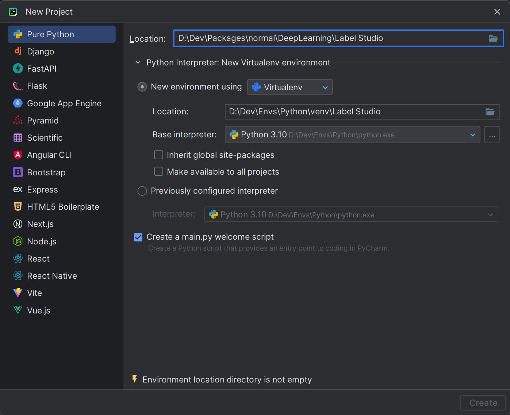
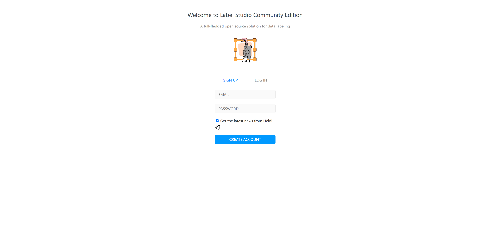
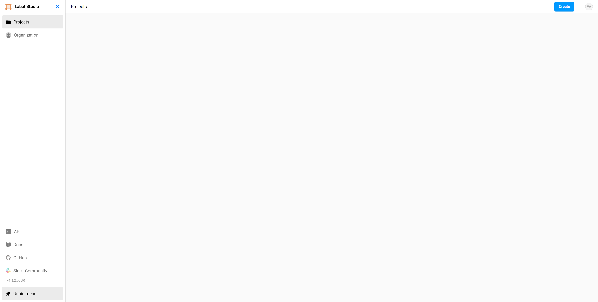
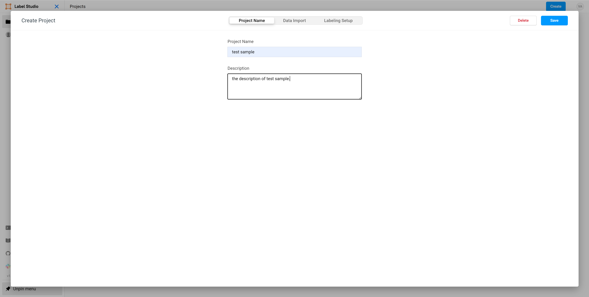
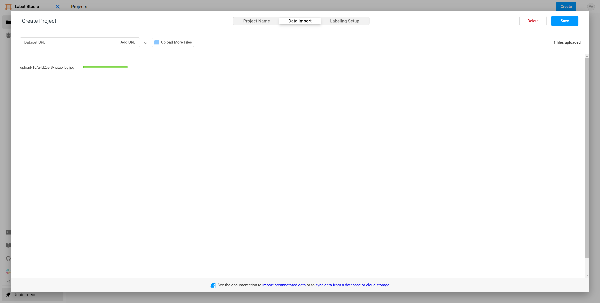
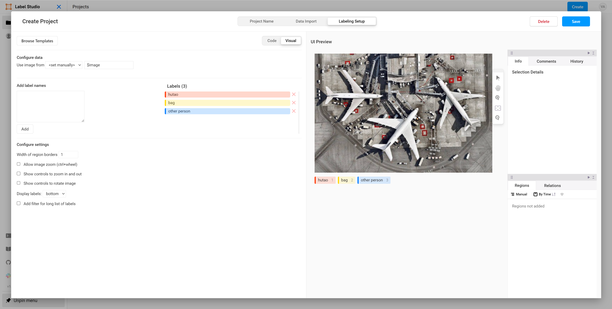
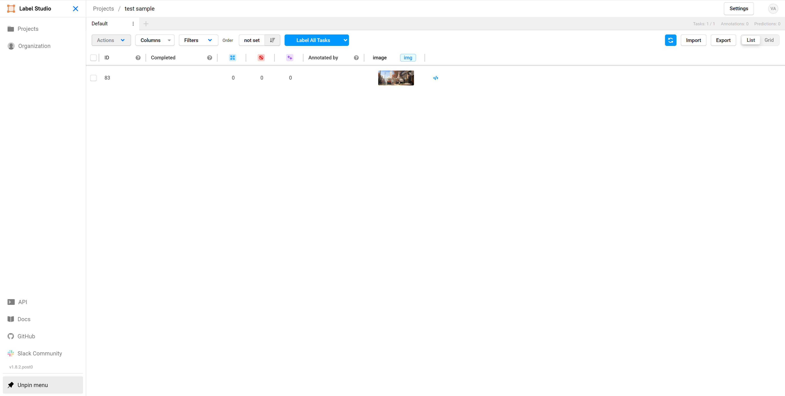
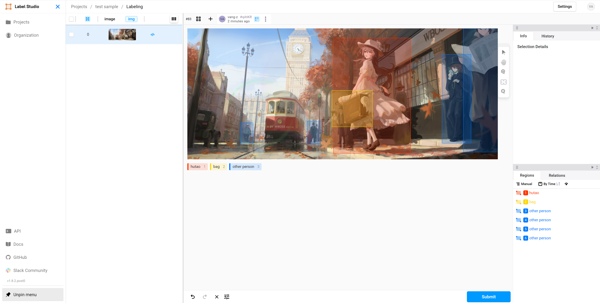
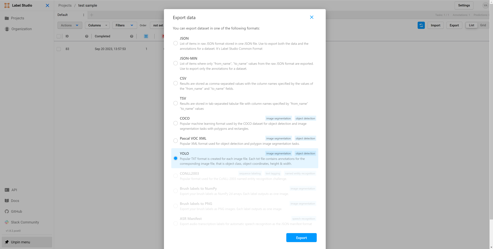

### Abstract

This article will explain how to annotate a [YOLOv8](https://github.com/ultralytics/ultralytics) dataset using [Label Studio](https://labelstud.io), as well as how to extract image frames from video files using [Python](https://python.org).

### Download/Install

- [x] <a>(Required)</a> First, create a Python virtual environment (<a>Python version 3.7+</a> required) to ensure the project is isolated from other environments. Here, we use the [virtualenv](https://virtualenv.pypa.io/en/latest/) included with [Pycharm](https://www.jetbrains.com/zh-cn/pycharm) to create it:




- [x] <a>(Required)</a> After creating the virtual environment, open the terminal and enter <a>`pip install label-studio opencv-python`</a> to install the necessary dependencies.

```bash
pip install label-studio opencv-python
```

### Extracting Frames from Video Files

- [ ] <a>(Optional)</a> Create and run the <a>`segmentation.py`</a> file to extract frames from video files.

```python
import cv2


def main(source: str, s: int = 60) -> None:
    """
    :param source:  Video Files
    :param s:       Frame extraction interval, defaulting to saving one frame every 60 frames
    :return:
    """
    video = cv2.VideoCapture(source)
    frame_num = 0
    success, frame = video.read()
    while success:
        if frame_num % s == 0:
            cv2.imwrite(f"./images/{frame_num // s}.png", frame)
        success, frame = video.read()
        frame_num += 1
    video.release()
    cv2.destroyAllWindows()


if __name__ == '__main__':
    main('./videos/sample.mp4')

```

### Image Annotation

- [x] <a>(Required)</a> Enter <a>`label-studio start`</a> in the terminal to start the service, and then open a browser to access the [Label Studio](http://localhost:8080) page.

```bash
label-studio start
```

- [x] <a>(Required)</a> First-time users of Label Studio need to register and log in.



- [x] <a>(Required)</a> After logging into Label Studio, click the "Create" button in the top right corner to create a project.



- [x] <a>(Required)</a> Enter the project name and description.



- [x] <a>(Required)</a> Import the data to be annotated.



- [x] <a>(Required)</a> Configure the project labels: <a>`Computer Vision`</a> <a>-></a> <a>`Object Detection with Bounding Boxes`</a> and click the <a>"Save"</a> button in the upper right corner to save.



- [x] <a>(Required)</a> Click on the unannotated images to begin labeling.



- [x] <a>(Required)</a> Press the corresponding number for the label and drag the mouse to annotate. After completing the annotation, click the <a>"Submit"</a> button in the lower right corner to submit.



### Export Dataset

- [x] <a>(Required)</a> Click the <a>Export</a> button in the top right corner, select <a>YOLO</a> as the data format to export, and click the <a>Export</a> button again. The browser will then automatically download the annotated dataset.



- [x] <a>(Required)</a> Unzip the downloaded dataset. The directory structure is as follows:

```bash
.
│ classes.txt
│ notes.json
│
├─images
│   a4d2cef8-hutao_bg.jpg
│
└─labels
    a4d2cef8-hutao_bg.txt
```

- [x] <a>(Required)</a> Create three folders named <a>`train`</a>, <a>`test`</a>, and <a>`val`</a> inside the <a>`images`</a> and <a>`labels`</a> folders. Distribute the files among these folders in an <a>8:1:1</a> ratio. The organized directory structure is as follows:
  
Note: The filenames in the <a>`images`</a> and <a>`labels`</a> subfolders must correspond exactly to each other.

```bash
.
│ classes.txt
│ notes.json
│
├─images
│  ├─test
│  │   a4d2cef8-hutao_bg.jpg
│  │
│  ├─train
│  │   a4d2cef8-hutao_bg.jpg
│  │
│  └─val
│      a4d2cef8-hutao_bg.jpg
│
└─labels
    ├─test
    │   a4d2cef8-hutao_bg.txt
    │
    ├─train
    │   a4d2cef8-hutao_bg.txt
    │
    └─val
        a4d2cef8-hutao_bg.txt
```

- [x] <a>(Required)</a> Create a <a>`data.yaml`</a> file in the root directory of the dataset. The content and directory structure are as follows:

Note: In the <a>`data.yaml`</a> file, <a>`nc`</a> represents the total number of label categories in the dataset, and <a>`names`</a> refers to the names of these labels. This information can be found in the <a>`classes.txt`</a> file.

::: code-tabs#shell

@tab File contents

```yaml
# dataset path
train: ./images/train
val: ./images/val
test: ./images/test

# number of classes
nc: 3

# class names
names: [
  "bag",
  "hutao",
  "other person",
]

```

@tab Directory structure

```bash
.
│ classes.txt
│ data.yaml
│ notes.json
│
├─images
│  ├─test
│  │   a4d2cef8-hutao_bg.jpg
│  │
│  ├─train
│  │   a4d2cef8-hutao_bg.jpg
│  │
│  └─val
│      a4d2cef8-hutao_bg.jpg
│
└─labels
    ├─test
    │   a4d2cef8-hutao_bg.txt
    │
    ├─train
    │   a4d2cef8-hutao_bg.txt
    │
    └─val
        a4d2cef8-hutao_bg.txt
```

:::

With this, a custom dataset suitable for [YOLOv8](https://github.com/ultralytics/ultralytics) has been successfully created. In our next issue, we will explain how to train a custom dataset using [YOLOv8](https://github.com/ultralytics/ultralytics)([Training/inference on a custom dataset in Label Studio using YOLOv8](https://richelf.tech/en/posts/2024-09/2a7262df-2893-42af-8e66-0fb59d807aef.html))。. 

<Sponsor />
