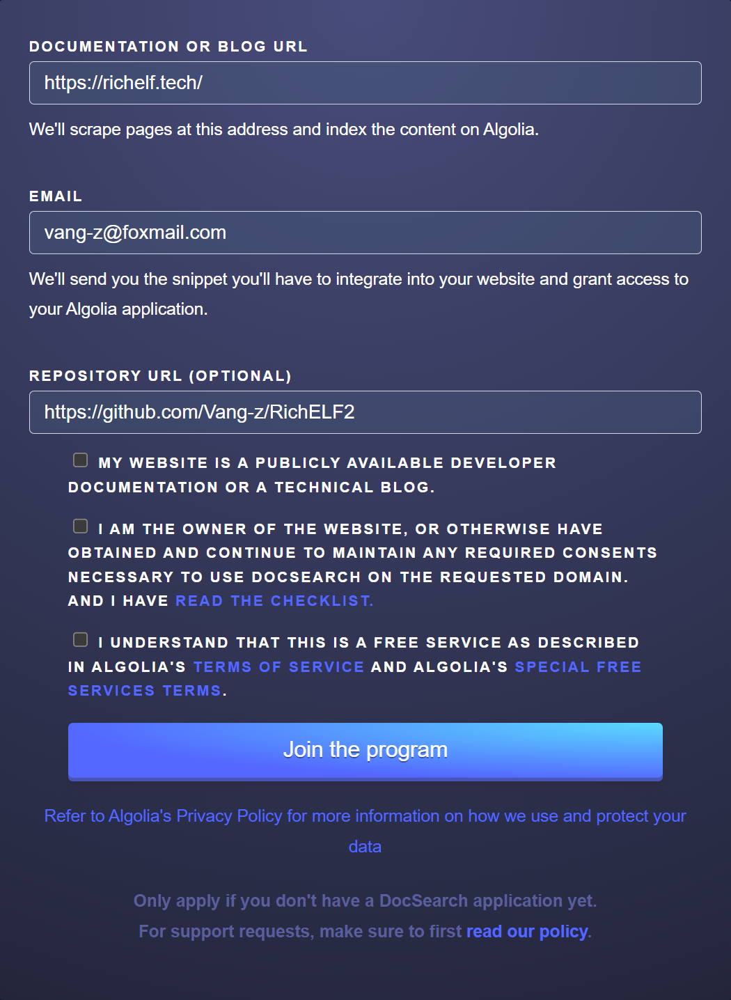
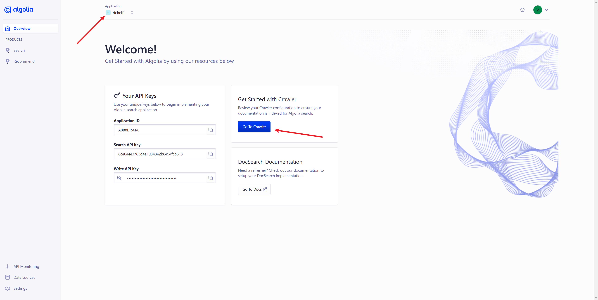
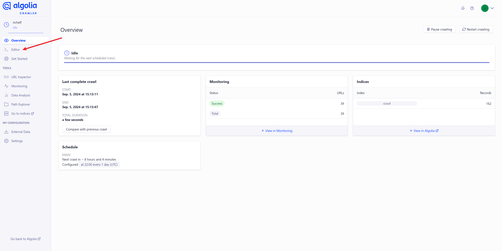

### Abstract

This article will elucidate the process of integrating [Algolia](https://docsearch.algolia.com/apply/) to enhance the search capabilities of a website, using [VuePress](https://vuejs.press/) as the exemplar for a blog site.

### Apply

 {.left-img}

Before utilizing [Algolia](https://docsearch.algolia.com/apply/), it is necessary to submit an application on their official website. Access the application link here: [https://docsearch.algolia.com/apply/](https://docsearch.algolia.com/apply/)

- [x] <a>(Required)</a> Domain
- [x] <a>(Required)</a> Email
- [ ] <a>(Optional)</a> Repository Address
---
<br style="clear: both"/>

After submitting the application, one must patiently await the review process on the official website, which typically takes <a>1 to 3 days</a>. Upon successful review, an email notification will be dispatched from the official site. Receiving an email with the following contents signifies the approval process and enables progression to the subsequent steps.

```mail
Hello again,

Congratulations! Your search is now ready. We've prepared your DocSearch app, please follow the steps below:

DocSearch uses the Algolia hosted crawler to insert records found on your website into your Algolia index. The crawler has already been started automatically!
- Once you accept the invitation below, you:
-- May be prompted to go through an upload data step. If so, use the Algolia provided sample data and complete the process.
-- Otherwise, you'll be brought to the Algolia dashboard.
- Note that the "Getting Started" page accessed from the dashboard home page does not apply to DocSearch users.
- If you need to make changes to the crawler:
-- You can access the crawler from dashboard.algolia.com->data sources->crawler->click on your crawler
-- Note - While you are able to, please do not delete the crawler or create a new one.

Accept this invitation to get started!
```

### Activate the components

Taking the blog website with the [Vuepress-Theme-Hope](https://theme-hope.vuejs.press/) theme as an example, it shares similarities with [VuePress](https://vuejs.press/).

```typescript
// Add the following code to the `plugins` section in the `theme.ts` file:
// `indexName`: The name configured in Algolia
// `appId`: The Application ID from the Algolia dashboard
// `apiKey`: The Search API Key from the Algolia dashboard [This key can be publicly used]
docsearch: {
  indexName: "richelf",
  appId: "A8B8L156RC",
  apiKey: "6ca6a4e3763d4a19343e2b6494fcb613",
}

```

### Configuring [Algolia](https://dashboard.algolia.com/) data services (utilizing the official web crawler)

1. Navigate to the [Algolia](https://dashboard.algolia.com/) dashboard at [https://dashboard.algolia.com/](https://dashboard.algolia.com/), choose the application corresponding to the <a>`indexName`</a> mentioned above in the navigation bar, and click the [Go To Crawler](https://crawler.algolia.com/admin/crawlers) button.



2. Upon accessing the [crawler console](https://crawler.algolia.com/admin/crawlers/), click on the <a>`Editor`</a> tab in the sidebar, and configure the parsing method according to the requirements of your website.



```typescript
// Please modify the content of `recordProps` in `actions` based on the `html` structure of your website.
// For example: If the content to be retrieved is within the `.vp-page` class using `p, li, a, td, span` tags,
// you can align it with the sample code provided.
actions: [
  {
    indexName: "richelf",
    pathsToMatch: ["https://richelf.tech/**"],
    recordExtractor: ({ $, helpers }) => {
      return helpers.docsearch({
        recordProps: {
          lvl0: {
            selectors: ".vp-sidebar-heading.active",
            defaultValue: "Documentation",
          },
          lvl1: ".vp-page h1",
          lvl2: ".vp-page h2",
          lvl3: ".vp-page h3",
          lvl4: ".vp-page h4",
          lvl5: ".vp-page h5",
          lvl6: ".vp-page h6",
          content: ".vp-page p, .vp-page li, .vp-page a, .vp-page td, .vp-page span",
          lang: "",
          tags: {
            defaultValue: ["v1"],
          },
        },
        indexHeadings: true,
        aggregateContent: true,
      });
    },
  },
],

```

3. Upon configuring, click the 'Save' button in the top right corner to save your settings. Subsequently, click 'Start Crawl' to establish data mapping. With these actions completed, the setup for Algolia is finalized.

::: warning
Following the establishment of data mapping, a waiting period is necessary before the search service becomes operational. Upon accessing the Algolia dashboard at [Algolia](https://dashboard.algolia.com/), you can initiate search testing by selecting the 'Search' tab in the sidebar.
:::

---

<Sponsor />
