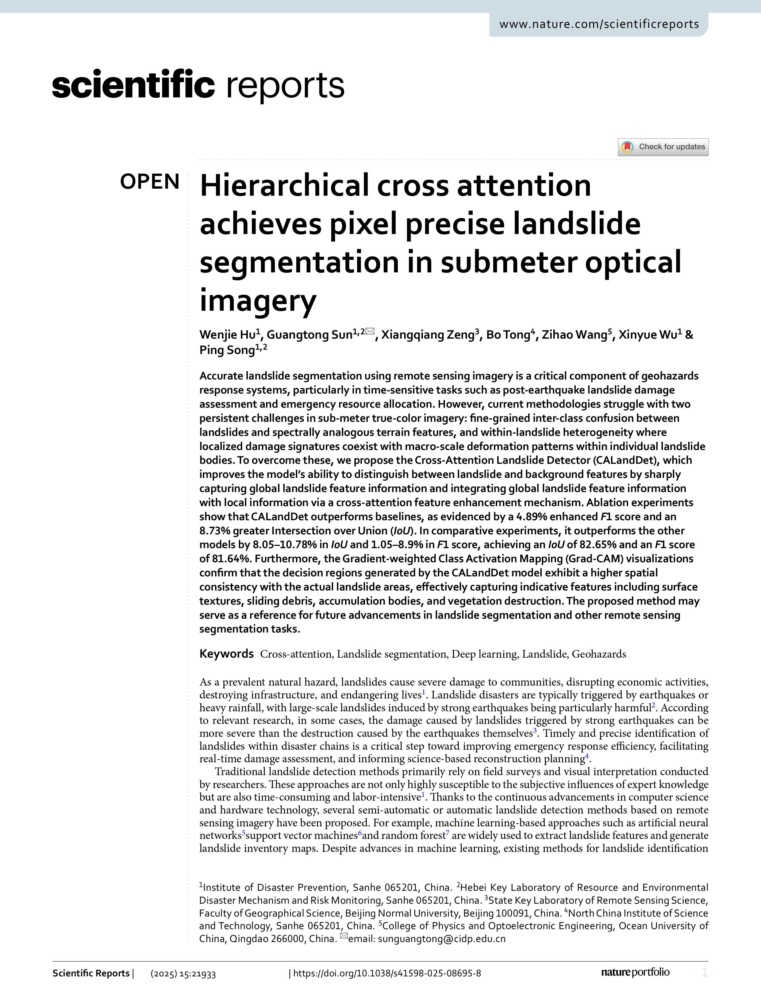
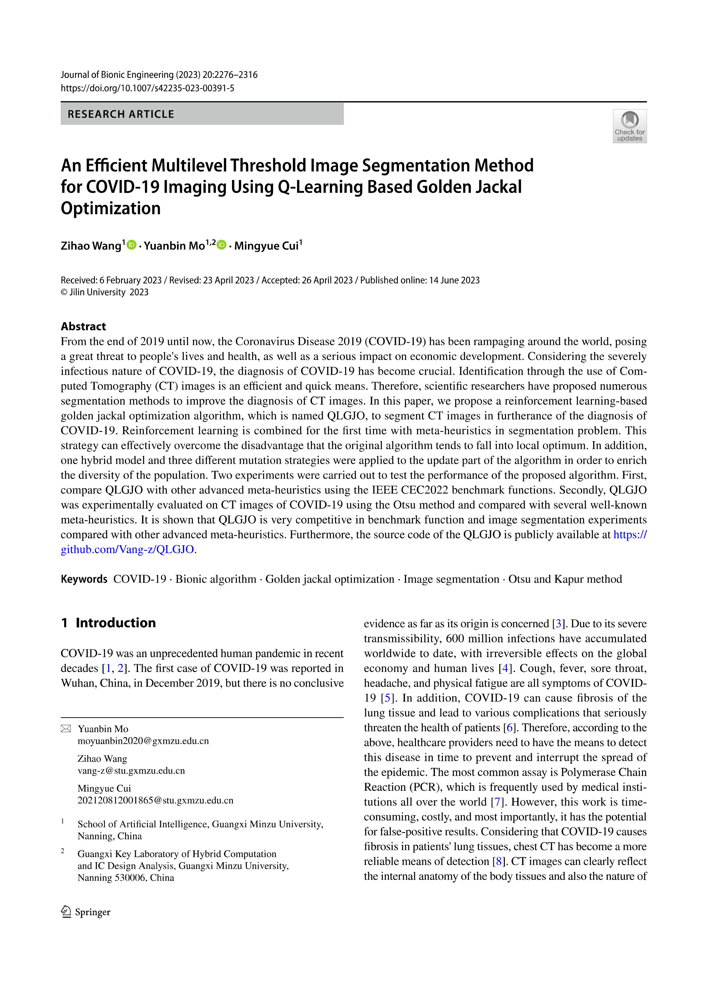
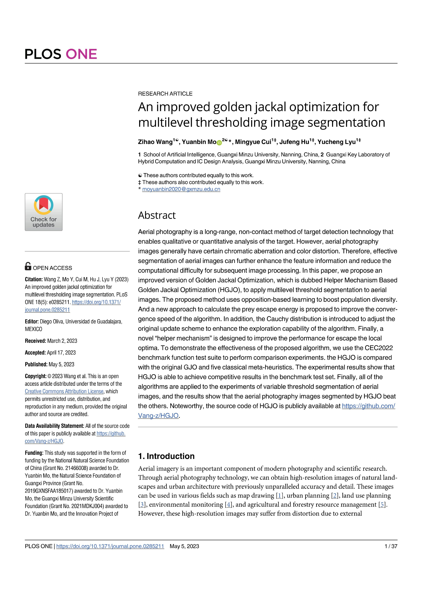

### Hierarchical cross attention achieves pixel precise landslide segmentation in submeter optical imagery {style="display: none;"}

<table style="position: relative; height: 100%; width: 100%; text-align: center;">
  <tr>
    <td colspan="3" style="position: relative; font-weight: 600;"><a href="https://doi.org/10.1038/s41598-025-08695-8" target="_blank">Hierarchical cross attention achieves pixel precise landslide segmentation in submeter optical imagery</a></td>
  </tr>
  <tr>
    <td colspan="3" style="position: relative; font-weight: 600;">Wenjie Hu1, Guangtong Sun2,*, Xiangqiang Zeng3, Bo Tong4, <a><strong>Zihao Wang5</strong></a>, Xinyue Wu6, Ping Song7</td>
  </tr>
  <tr style="position: relative;">
    <td rowspan="4" style="position: relative; width: 20%; padding: 2px 12px 12px 2px;">
    
      
    
    </td>
    <td colspan="2"><a href="https://www.nature.com/srep/" target="_blank">Scientific Reports [2025-07-01]</a></td>
  </tr>
  <tr>
    <td>Impact Factor</td>
    <td>3.9</td>
  </tr>
  <tr>
    <td>CAS Journal Ranking</td>
    <td>Q3</td>
  </tr>
  <tr>
    <td>Self-citation Rate</td>
    <td>5.10%</td>
  </tr>
</table>

---

### An Efficient Multilevel Threshold Image Segmentation Method for COVID-19 Imaging Using Q-Learning Based Golden Jackal Optimization {style="display: none;"}

<table style="position: relative; height: 100%; width: 100%; text-align: center;">
  <tr>
    <td colspan="3" style="position: relative; font-weight: 600;"><a href="https://doi.org/10.1007/s42235-023-00391-5" target="_blank">An Efficient Multilevel Threshold Image Segmentation Method for COVID-19 Imaging Using Q-Learning Based Golden Jackal Optimization</a></td>
  </tr>
  <tr>
    <td colspan="3" style="position: relative; font-weight: 600;"><a><strong>Zihao Wang1</strong></a>, Yuanbin Mo2,*, Mingyue Cui3</td>
  </tr>
  <tr style="position: relative;">
    <td rowspan="4" style="position: relative; width: 20%; padding: 2px 12px 12px 2px;">
    
      
    
    </td>
    <td colspan="2"><a href="https://link.springer.com/journal/42235" target="_blank">Journal of Bionic Engineering [2023-06-14]</a></td>
  </tr>
  <tr>
    <td>Impact Factor</td>
    <td>5.8</td>
  </tr>
  <tr>
    <td>CAS Journal Ranking</td>
    <td>Q3</td>
  </tr>
  <tr>
    <td>Self-citation Rate</td>
    <td>6.90%</td>
  </tr>
</table>

---

### An improved golden jackal optimization for multilevel thresholding image segmentation {style="display: none;"}

<table style="position: relative; height: 100%; width: 100%; text-align: center;">
  <tr>
    <td colspan="3" style="position: relative; font-weight: 600;"><a href="https://doi.org/10.1371/journal.pone.0285211" target="_blank">An improved golden jackal optimization for multilevel thresholding image segmentation</a></td>
  </tr>
  <tr>
    <td colspan="3" style="position: relative; font-weight: 600;"><a><strong>Zihao Wang1</strong></a>, Yuanbin Mo2,*, Mingyue Cui3, Jufeng Hu4, Yucheng Lyu5</td>
  </tr>
  <tr style="position: relative;">
    <td rowspan="4" style="position: relative; width: 20%; padding: 2px 12px 12px 2px;">
    
      
    
    </td>
    <td colspan="2"><a href="https://journals.plos.org/plosone/" target="_blank">PLoS One [2023-05-05]</a></td>
  </tr>
  <tr>
    <td>Impact Factor</td>
    <td>2.6</td>
  </tr>
  <tr>
    <td>CAS Journal Ranking</td>
    <td>Q3</td>
  </tr>
  <tr>
    <td>Self-citation Rate</td>
    <td>3.80%</td>
  </tr>
</table>
