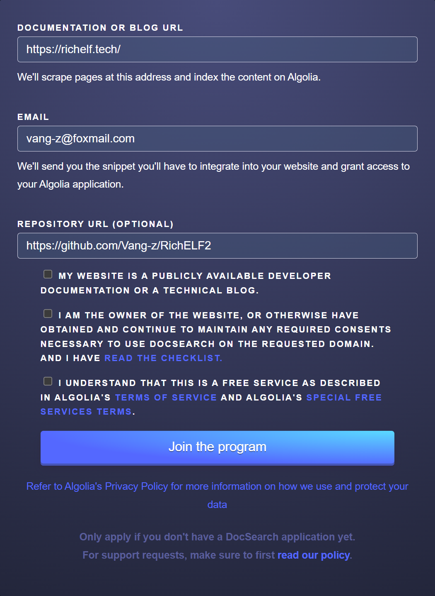
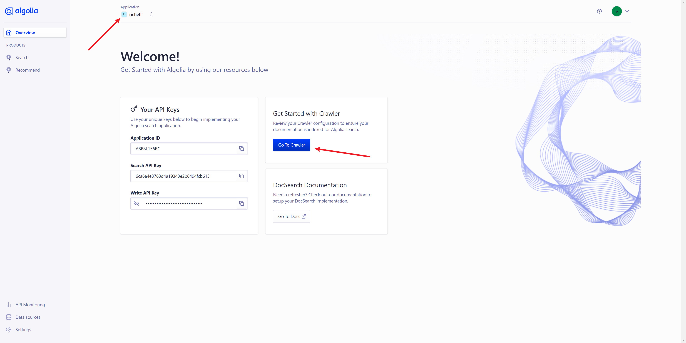
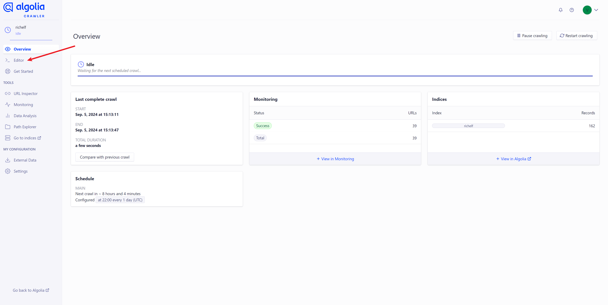

### 摘要

本文将介绍如何使用[Algolia](https://docsearch.algolia.com/apply/)为网站增加搜索功能, 此处以[VuePress](https://vuejs.press/)的博客网站为例。

### 提交申请

 {.left-img}

[Algolia](https://docsearch.algolia.com/apply/)使用之前需要向官网提交申请, 申请链接: 
[https://docsearch.algolia.com/apply/](https://docsearch.algolia.com/apply/)

- [x] <a>(必选)</a> 网站域名
- [x] <a>(必选)</a> 申请邮箱
- [ ] <a>(可选)</a> 仓库地址
---
<br style="clear: both"/>

提交申请后既可耐心等待, 官网需要<a>1~3天</a>时间进行审查, 通过审查后即可收到官网发送的邮件通知, 收到以下内容的邮件即代表通过审核可以进行下一步操作。

```mail
Hello again,

Congratulations! Your search is now ready. We've prepared your DocSearch app, please follow the steps below:

DocSearch uses the Algolia hosted crawler to insert records found on your website into your Algolia index. The crawler has already been started automatically!
- Once you accept the invitation below, you:
-- May be prompted to go through an upload data step. If so, use the Algolia provided sample data and complete the process.
-- Otherwise, you'll be brought to the Algolia dashboard.
- Note that the "Getting Started" page accessed from the dashboard home page does not apply to DocSearch users.
- If you need to make changes to the crawler:
-- You can access the crawler from dashboard.algolia.com->data sources->crawler->click on your crawler
-- Note - While you are able to, please do not delete the crawler or create a new one.

Accept this invitation to get started!
```

### 导入组件相关代码

此处以[Vuepress-Theme-Hope](https://theme-hope.vuejs.press/)主题的博客网站为例, 与[VuePress](https://vuejs.press/)大同小异。

```typescript
// 在 `theme.ts` 文件的 plugins 中增加以下代码 
// `indexName`: Algolia中配置的名称
// `appId`: Algolia首页的Application ID
// `apiKey`: Algolia首页的Search API Key [该key可以公开使用]
docsearch: {
  indexName: "richelf",
  appId: "A8B8L156RC",
  apiKey: "6ca6a4e3763d4a19343e2b6494fcb613",
}

```

### 配置[Algolia](https://dashboard.algolia.com/)数据服务(运行官方爬虫)

1. 进入[Algolia](https://dashboard.algolia.com/)的控制台[https://dashboard.algolia.com/](https://dashboard.algolia.com/), 在导航栏选择与上文<a>`indexName`</a>对应的应用, 并点击[Go To Crawler](https://crawler.algolia.com/admin/crawlers)按钮。



2. 打开[爬虫控制台](https://crawler.algolia.com/admin/crawlers/)后点击侧边栏的<a>`Editor`</a>选项卡, 按需配置和你网站对应的解析方式。



```typescript
// 根据网站的 `html` 结构修改 `actions` 中的 `recordProps` 内容
// 例如: 需要检索的内容在 `.vp-page` 类中的 `p, li, a, td, span` 标签, 
// 则可以与示例代码保持一致。
actions: [
  {
    indexName: "richelf",
    pathsToMatch: ["https://richelf.tech/**"],
    recordExtractor: ({ $, helpers }) => {
      return helpers.docsearch({
        recordProps: {
          lvl0: {
            selectors: ".vp-sidebar-heading.active",
            defaultValue: "Documentation",
          },
          lvl1: ".vp-page h1",
          lvl2: ".vp-page h2",
          lvl3: ".vp-page h3",
          lvl4: ".vp-page h4",
          lvl5: ".vp-page h5",
          lvl6: ".vp-page h6",
          content: ".vp-page p, .vp-page li, .vp-page a, .vp-page td, .vp-page span",
          lang: "",
          tags: {
            defaultValue: ["v1"],
          },
        },
        indexHeadings: true,
        aggregateContent: true,
      });
    },
  },
],

```

3. 配置完毕后点击右上角<a>`Save`</a>按钮进行保存, 并点击<a>`Start Crawl`</a>建立数据映射, 至此[Algolia](https://dashboard.algolia.com/)的配置就完成了。

::: warning
数据映射建立完毕后需要等待一段时间才能使用搜索服务, 进入[Algolia](https://dashboard.algolia.com/)控制台后, 可以点击侧边栏的<a>`Search`</a>选项卡进行搜索测试。
:::

<Sponsor />
