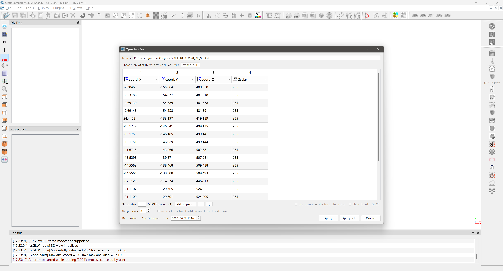
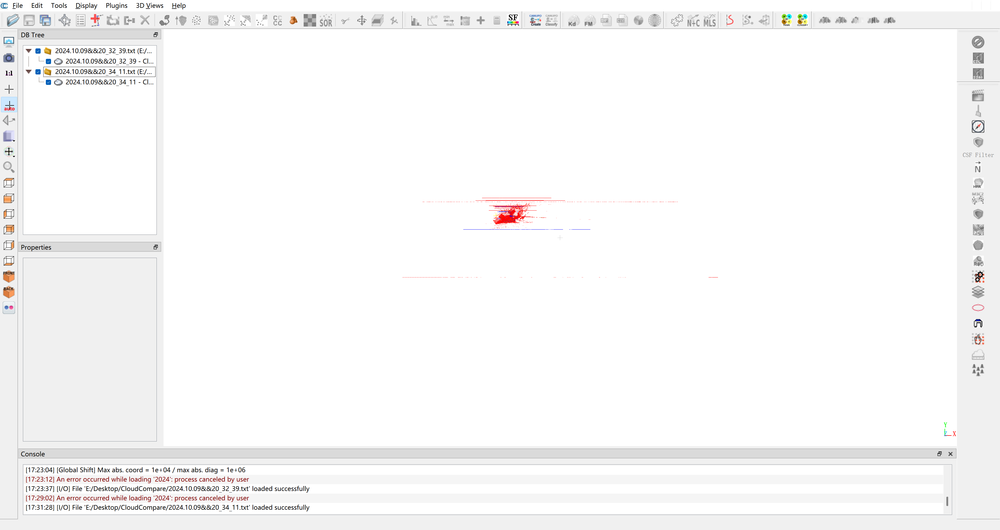
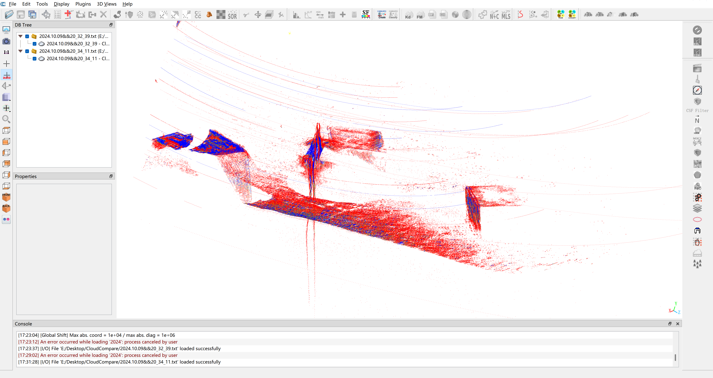

### 摘要

本文将介绍如何使用<a>CloudCompare</a>对<a>三维点云</a>进行修改和拼接, 其中包括对点云进行降噪/手动删减以及位置配准等操作。

### 下载/安装

- [x] <a>(必选)</a> 首先前往[CloudCompare](https://cloudcompare.org/)官网下载软件并进行安装, 本文使用的软件版本为[`2.13.2`](https://cloudcompare.org/release/CloudCompare_v2.13.2_setup_x64.exe)。

### 修改语言

- [ ] <a>(可选)</a> 点击菜单栏中的<a>`Display -> Language Translation`</a>选择<a>`简体中文`</a>, 修改完成后需要重新启动软件才能生效。

### 导入点云数据

- [x] <a>(必选)</a> 将准备好的点云数据拖入[CloudCompare](https://cloudcompare.org/)中, 按需勾选功能, 一般情况下保持默认之间点击<a>`Apply`</a>既可。

点云导入完成后如下所示, 这里我们导入了两组同一目标的点云数据用以后续进行配准。导入完成后软件左上角会显示对应的点云, 可以勾选是否进行显示, 软件中心会有相应的可视化信息。

### 查看点云数据

使用鼠标可以对点云进行整体旋转/缩放/平移, 可以观察到这两份点云数据有一定的位置偏差, 并且存在较多的噪声, 因此, 接下来会先对点云进行降噪/手动删减处理。

### 查看点云数据

使用鼠标可以对点云进行整体旋转/缩放/平移, 可以观察到这两份点云数据有一定的位置偏差, 并且存在较多的噪声, 因此, 接下来会先对点云进行降噪和删减处理。

<Sponsor />
